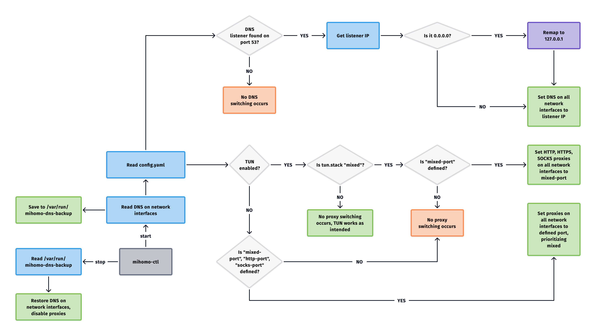

<p align="center">
  
</p>
<h1 align="center">mihomoCC</h1>
<h3 align="center" style="margin-top: 0; margin-bottom: 10px;">A simple menu bar agent for Mihomo that respects your configuration.</h3>

<p align="center">
  
</p>

## Features
- Toggle Mihomo on and off with root privileges (for TUN)
- Automatic config-aware DNS and system proxy switching with indication
- Optional upload/download speed monitoring
- Shortcut buttons for opening web UI, checking logs and editing or reloading config.yaml
- Profile picker for multiple configurations
- Supports macOS 11.5+, universal binary, only ~3MB

This app is based on [mihomo-ctl](https://github.com/ChaCha20-Poly-1305/mihomo-ctl-mac.git) - my CLI wrapper. It will be installed alongside the app and can be accessed from the terminal any time.

## What's the difference between this and other Mihomo clients?
This app fills the gap between traditional Mihomo clients with low-level controls and standalone Mihomo core setups - you won't need to touch the terminal or your system settings to use this, but you will have **full control** over your Mihomo configuration. Most clients tend to override Mihomo configurations to provide GUI controls, and it's not always the best or most reliable thing to do compared to managing the core via a single YAML.

It will live in your menu bar, providing you with a straightforward way to turn Mihomo on and off, monitor connection speeds, check its status or reload its configuration.

## Roadmap
As of now, no additions are planned aside from minor tweaks. Some things may be added later, but remember that this app was made to **be simple** and **preserve Mihomo-native configuration**, avoiding introducing points of failure to your proxy setup. It will not evolve into a complete Mihomo GUI - you can deploy a web UI like Zashboard or switch to a client for that. You can also propose your own changes in Issues or PRs and I will review them.

## Security

The app will request your admin password for a one-time configuration procedure with AppleScript to install its backend (mihomo-ctl) and add a sudoers entry for the backend to avoid asking for your password later. App itself is entirely offline, doesn't collect or send any data anywhere, and mihomo-ctl is the only part that gets root privileges. If you trust [Mihomo core](https://github.com/MetaCubeX/mihomo.git) (the actual part that accesses the internet) and [mihomo-ctl](https://github.com/ChaCha20-Poly-1305/mihomo-ctl-mac.git) - you can trust this.

The code is fully open-source and minimal - feel free to audit or build the app yourself.

If you don't want to provide your password for automatic setup, step 3 in Setup (advanced) describes how to do it manually.

## How it works
Starting and stopping Mihomo is handled by mihomo-ctl (available in terminal). This is a diagram for what it specifically does:
<p align="center">
  
</p>

A [YAML example](https://github.com/ChaCha20-Poly-1305/mihomoCC/blob/main/templates/config.yaml) is available.

## Popover
**Profile picker:** mihomoCC creates `mihomo` folder in `~.config`, as well as `user-profiles` inside `mihomo`. It will read YAML files inside `user-profiles` and copy the active YAML as `~/.config/mihomo/config.yaml` for mihomo-ctl to pick up.

**Web UI:** appears with `external-ui` defined in your active YAML. Opens a browser page on detected UI path.

**Log:** opens mihomo's real-time log in Console. 

**Config:** opens your active YAML in TextEdit. 

**Reload:** forces a reload of active YAML and copies it to `~/.config/mihomo/config.yaml`. If changes are detected, mihomoCC will ask you to restart Mihomo.

**No DNS switching:** disables mihomo-ctl's DNS switching logic. Only use it if you know what you're doing - can cause a DNS leak when misused.

mihomoCC will never start or stop Mihomo without user's explicit input.

## Setup (simple)
1. Install Mihomo with [Homebrew](https://brew.sh)
```
brew install mihomo
```
2. Download the latest mihomoCC from Releases, unpack and run it. Enter your password to install the backend and add sudoers entry.
3. Open your profiles folder and add your YAML files there. Make sure DNS, TUN and/or proxy ports are defined inside YAML - refer to [YAML example](https://github.com/ChaCha20-Poly-1305/mihomoCC/blob/main/templates/config.yaml).

## Setup (advanced)
1. Download a Mihomo binary for your Mac from Homebrew or its official [GitHub repo](https://github.com/MetaCubeX/mihomo.git) and make sure it's available in PATH.
2. Download the latest mihomoCC from Releases or build it from source with Xcode.
3. Download mihomo-ctl (or extract from source files) and run these commands as root to install it and stop it from asking for password:
```
mkdir -p /usr/local/bin
install -m 755 mihomo-ctl /usr/local/bin/mihomo-ctl
echo "%admin ALL=(ALL) NOPASSWD: /usr/local/bin/mihomo-ctl" > /etc/sudoers.d/mihomo-ctl
chmod 440 /etc/sudoers.d/mihomo-ctl
```
4. Copy your YAML files into `~/.config/mihomo/user-profiles`. Make sure DNS, TUN and/or proxy ports are defined inside YAML.

## Uninstall
1. Click "Uninstall" in the popover to remove mihomo-ctl and sudoers entry (will require your password), OR quit mihomoCC and run these commands as root: 
```
rm /usr/local/bin/mihomo-ctl
rm /etc/sudoers.d/mihomo-ctl
```
2. Drag mihomoCC to Trash. This will not remove your YAML files or Mihomo itself - only the app and its backend.

### Troubleshooting
mihomoCC has basic safeguards to revert network interface adjustments on shutdown, but they won't necessarily cover cases of OS crashing. If your network stops working with Mihomo and mihomoCC disabled, check your network interface settings and make sure your DNS isn't set to 127.0.0.1 or a bogus IP and proxies are disabled.

mihomoCC is designed to avoid introducing points of failure. If your proxy doesn't work correctly, the problem will almost certainly be tied to your YAML or Mihomo itself - before opening an issue, make sure you can't reproduce your problem without the app.

## Acknowledgements
- [mihomo](https://github.com/MetaCubeX/mihomo)
- [Zashboard](https://github.com/Zephyruso/zashboard)
