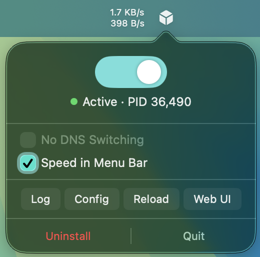

<p align="center">
  
</p>
<h1 align="center">mihomoCC</h1>
<h3 align="center" style="margin-top: 0; margin-bottom: 10px;">A simple menu bar agent for Mihomo that respects your configuration.</h3>

<p align="center">
  
</p>

## Features
- Toggle Mihomo on and off with root privileges (for TUN)
- Automatic config-aware DNS and system proxy switching
- Real-time upload/download speed monitoring
- Shortcut buttons for opening web UI, checking logs and editing or reloading config.yaml
- Supports macOS 11.5+, universal binary, only ~3MB

This app is based on [mihomo-ctl](https://github.com/ChaCha20-Poly-1305/mihomo-ctl-mac.git) - my CLI wrapper. It will be installed alongside the app and can be accessed from the terminal any time.

## What's the difference between this and other Mihomo clients?
This app fills the gap between traditional Mihomo clients with low-level controls and standalone Mihomo core setups - you won't need to touch the terminal or your system settings to use this, but you will have **full control** over your Mihomo configuration. Most clients tend to override Mihomo configurations to provide GUI controls, and it's not always the best thing to do.

It will live in your menu bar, providing you with a straightforward way to turn Mihomo on and off, monitor connection speeds, check its status or reload its configuration.

## Roadmap
As of now, the only planned addition is support for multiple config.yaml profiles. More things may be added, but **simplicity**, **stability** and **native yaml configuration** are the key parts of this tool, so it will not evolve into a complete Mihomo GUI - you can deploy a web UI like Zashboard or switch to a client for that.

## Security

The app will request your admin password for a one-time configuration procedure with AppleScript to install its backend (mihomo-ctl) and add a sudoers entry for the backend to avoid asking for your password later. App itself is entirely offline, doesn't collect or send any data anywhere, and only escalates privileges for the backend. If you trust [Mihomo core](https://github.com/MetaCubeX/mihomo.git) (the actual part that accesses the internet) and [mihomo-ctl](https://github.com/ChaCha20-Poly-1305/mihomo-ctl-mac.git) - you can trust this.

The code is fully open-source and minimal - feel free to audit or build the app yourself.

If you don't want to provide your password for automatic setup, step 3 in Setup (advanced) describes how to do it manually.

### Note on usage
Automatic DNS and proxy switching works by checking the DNS and TUN blocks in your `config.yaml`. 

**DNS:** It detects Mihomo's local DNS listener IP. If it's present on port 53, mihomo-ctl will set DNS for all network interfaces to that IP on Mihomo startup and revert to the previous state on Mihomo shutdown. If a DNS listener can't be found or isn't on port 53, the switching will not occur. If you set it to 0.0.0.0, mihomo-ctl will remap it to 127.0.0.1 for interfaces to properly work.

A "No DNS switching" toggle is also available.

**Proxy:** It detects Mihomo's TUN block and defined ports. If TUN is enabled, tun-stack set to `mixed` and a `mixed-port` is defined, mihomo-ctl will enable SOCKS, HTTP, HTTPS proxies on `mixed-port` for all network interfaces on Mihomo startup and revert to the previous state on Mihomo shutdown. If TUN is enabled and tun-stack isn't `mixed`, the switching will not occur. If TUN is disabled and there are proxy ports defined (http, socks, mixed) - mihomoCC will switch proxies accordingly, prioritizing `mixed`. If TUN is disabled and no proxy ports are defined, the switching will not occur.

Both DNS and proxies will be reverted to the original state if macOS is shut down with the app still running, unless the shutdown is caused by a macOS crash.

An example `config.yaml` with information can be found in `templates` folder of this repo.

## Setup (simple)
1. Install Mihomo with [Homebrew](https://brew.sh)
```
brew install mihomo
```
2. Copy your `config.yaml` into `~/.config/mihomo/`. If there isn't a TUN block or proxy port defined, make sure to add it.
3. Download the latest mihomoCC from Releases, unpack and run it. Enter your password to install the backend and add sudoers entry.

## Setup (advanced)
1. Download a Mihomo binary for your Mac from the GitHub repo and make sure it's available in PATH.
2. Download the latest mihomoCC from Releases or build it from source with Xcode.
3. Download mihomo-ctl (or extract from source files) and run these commands as root to install it and stop it from asking for password:
```
mkdir -p /usr/local/bin
install -m 755 mihomo-ctl /usr/local/bin/mihomo-ctl
echo "%admin ALL=(ALL) NOPASSWD: /usr/local/bin/mihomo-ctl" > /etc/sudoers.d/mihomo-ctl
chmod 440 /etc/sudoers.d/mihomo-ctl
```
4. Copy your `config.yaml` into `~/.config/mihomo/`, set up a TUN block or proxy ports if absent. Now mihomoCC is ready to run - proxies or DNS listener will be picked up and set automatically.

## Uninstall
Click "Uninstall" in the popover to remove mihomo-ctl and sudoers entry (will require your password). Click "Quit" and drag the app to Trash. This will not uninstall Mihomo itself - only the app and its backend.

### Troubleshooting
The app has basic safeguards to revert network interface adjustments on shutdown, but they won't necessarily cover cases of crashing. If your network stops working with Mihomo and mihomoCC disabled, check your network interface settings and make sure your DNS isn't set to 127.0.0.1 and proxies are disabled.
